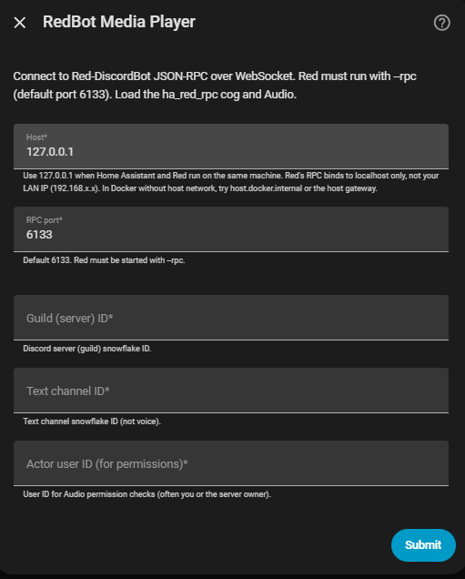
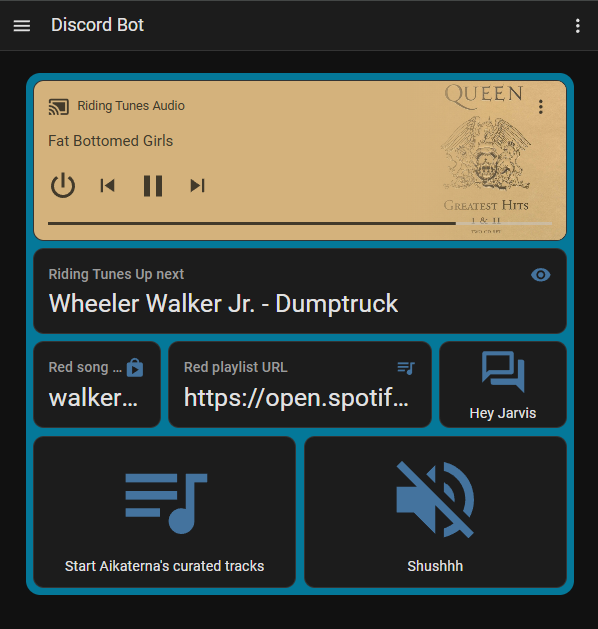
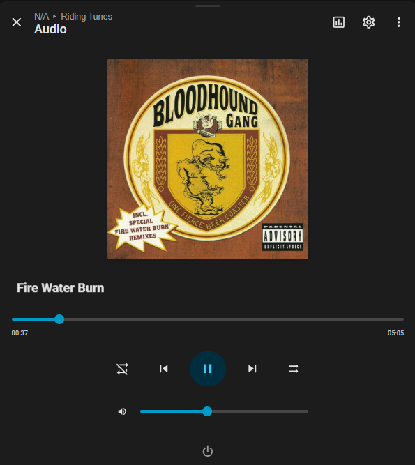
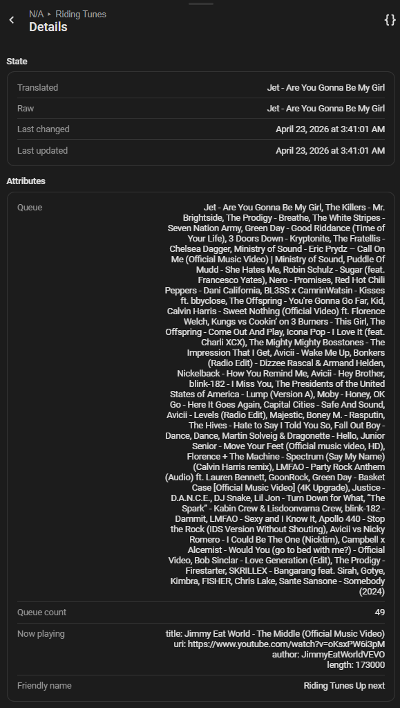

# RedBot Media Player (Home Assistant custom integration)

Connects Home Assistant to [Red-DiscordBot](https://github.com/Cog-Creators/Red-DiscordBot) using JSON-RPC over WebSocket, paired with the `ha_red_rpc` cog from [redbot-media-player-cog](https://github.com/AtticusG3/redbot-media-player-cog).

Release docs in this repository are aligned at `1.0.1` for `redbot_media_player`.

## Requirements

- Red running with `--rpc` (and optional `--rpc-port`, default 6133).
- Cog `ha_red_rpc` loaded from [redbot-media-player-cog](https://github.com/AtticusG3/redbot-media-player-cog), Audio loaded.
- HA and Red on the same host (RPC listens on `127.0.0.1`) or use a tunnel to forward loopback.

Related host setup for Home Assistant add-on users: [redBot-hass](https://github.com/AtticusG3/redBot-hass).

## Install (HACS-first)

### Option 1: HACS (recommended first)

1. HACS -> Integrations -> three-dot menu -> Custom repositories.
2. Add repository URL: `https://github.com/AtticusG3/redbot-media-player-homeassistant`
3. Category: Integration
4. Install **RedBot Media Player**
5. Restart Home Assistant.

### Option 2: Manual install

1. Copy the `redbot_media_player` folder into your Home Assistant `config/custom_components/` directory (include `services.yaml`; do not leave a zero-byte `services.yaml` or Home Assistant may log a load error).
2. Restart Home Assistant.
3. **Settings** -> **Devices & services** -> **Add integration** -> **RedBot Media Player** (or add via UI search).
4. Enter host (usually `127.0.0.1`), port, guild ID, text channel ID, and actor user ID (the same values used by the `ha_red_rpc` RPC methods).

## Related repositories

- Red cog (`ha_red_rpc`): [AtticusG3/redbot-media-player-cog](https://github.com/AtticusG3/redbot-media-player-cog)
- Home Assistant add-on host setup: [AtticusG3/redBot-hass](https://github.com/AtticusG3/redBot-hass)

## Services

Domain `redbot_media_player`:

| Service | Data |
| -------- | ------ |
| `play` | `query` (required), optional `config_entry_id` if multiple entries |
| `bumpplay` | `query` (required), optional `config_entry_id`; starts immediately via Red `[p]bumpplay` |
| `enqueue` | same as `play` |
| `pause` | optional `config_entry_id` |
| `queue` | optional `config_entry_id` |
| `playlist_start` | `playlist_name` (required), optional `config_entry_id` |
| `playlist_save_start` | `playlist_url` (required), optional `config_entry_id` |
| `summon` | optional `config_entry_id` (Red `[p]summon`) |
| `disconnect` | optional `config_entry_id` (Red `[p]disconnect`) |
| `voice_state` | optional `self_mute`, `self_deaf`, `config_entry_id` (Discord self-mute/deafen) |

Service responses return the JSON dict from the bot (e.g. `ok`, `now_playing`, `queue`).

## Beginner setup in Home Assistant (Helpers, Scripts, Automations)

If you are new to Home Assistant, this section walks through exactly where to click.

### A) Add Helpers (UI)

1. Go to **Settings -> Devices & services -> Helpers**.
2. Click **Create helper**.
3. Create **Text** helper:
   - Name: `Red song query`
   - Entity ID example: `input_text.red_song_query`
4. Create another **Text** helper:
   - Name: `Red playlist URL`
   - Entity ID example: `input_text.red_playlist_url`

### B) Add Scripts (UI)

1. Go to **Settings -> Automations & scenes -> Scripts**.
2. Click **Create script** -> **Start with an empty script**.
3. Create script: **Red - Play song now from input**
   - Add action -> **Call service**
   - Service: `redbot_media_player.bumpplay`
   - Service data:

```yaml
query: "{{ states('input_text.red_song_query') }}"
```

1. Create script: **Red - Save and start playlist from input**
   - Add action -> **Call service**
   - Service: `redbot_media_player.playlist_save_start`
   - Service data:

```yaml
playlist_url: "{{ states('input_text.red_playlist_url') }}"
```

1. (Optional voice script) Create script: **Red - Play song now from voice text**
   - Add a text field named `query`
   - Add action -> service `redbot_media_player.bumpplay`
   - Service data:

```yaml
query: "{{ query }}"
```

### C) Add Automations (UI)

#### Example 1: Press a button in dashboard cards to run the script

1. Add a button card that calls `script.red_play_song_from_input`.
2. Add a second button card for `script.red_save_and_start_playlist_from_input`.

#### Example 2: Auto-run when helper text changes

1. Go to **Settings -> Automations & scenes -> Automations**.
2. Create automation **Play when song query changes**.
3. Trigger: **State** -> entity `input_text.red_song_query`.
4. Condition (optional): helper is not empty.
5. Action: **Call service** -> `script.red_play_song_from_input`.

Example YAML:

```yaml
alias: Red - Play when query changes
triggers:
  - trigger: state
    entity_id: input_text.red_song_query
conditions:
  - condition: template
    value_template: "{{ states('input_text.red_song_query') | trim != '' }}"
actions:
  - action: script.red_play_song_from_input
mode: single
```

### D) YAML package option (single copy/paste)

If you prefer YAML over the UI, use the script/helper examples in this README as your package baseline:

- `input_text` helpers (`red_song_query`, `red_playlist_url`)
- scripts for play-by-name and playlist save/start
- optional voice-target script input field

### E) Dashboard examples and screenshots

The `docs/` folder includes practical Lovelace examples and screenshots:

- Dashboard card YAML example: `docs/lovelace-ui-cards.yaml`
- Config flow screenshot: `docs/config-flow.png`
- Combined Lovelace cards screenshot: `docs/lovelace-ui-cards.png`
- Media player entity screenshot: `docs/media-player-entity.png`
- Up next queue screenshot: `docs/up-next-queue.png`

Example screenshots:






## Media player entity

Each config entry creates one **media player** entity (polls `HAREDRPC__QUEUE` every 15 seconds). The **device name** prefers the Discord **voice channel** name, then **guild** name, then the config entry title (e.g. `Red RPC (127.0.0.1)`).

Power behavior is tied to voice connectivity:

- **Turn on** sends `HAREDRPC__SUMMON` (Red `[p]summon`).
- **Turn off** sends `HAREDRPC__DISCONNECT` (Red `[p]disconnect`).
- The media player state is **off** unless both are true:
  - Home Assistant can reach Red RPC (`HAREDRPC__QUEUE` poll succeeds), and
  - Red reports a current voice channel (`voice_channel_id` is present).

It shows title/artist/URI/duration from Lavalink, queue length, guild/voice context, and bot self-mute/deaf flags as attributes. Supported controls (depending on which RPC methods your loaded `ha_red_rpc` cog exposes): **turn on/off**, **play** / **pause** / **play/pause**, **stop**, **next track**, **previous track**, **clear queue**, **volume** and **mute** (Audio volume; mute uses a 1% sentinel and stores the previous level for restore), **shuffle** and **repeat** (mapped to Red toggles), **play media** (same as the `play` service).

There is no live **position** (Red RPC does not expose it yet). Saved playlists are exposed through a non-interactive RPC inventory:

- Diagnostic sensor **Playlists count** includes full `playlists` metadata in attributes.
- Dynamic **button** entities are created for each saved playlist (`Start <name>`).
- Buttons refresh from periodic polling and when playlists are started.

You can still call the **`summon`** / **`disconnect`** services directly in automations and scripts. In the media player UI, they are also available as power controls (turn on / turn off) when those RPC methods are registered.

## Diagnostic entities (mostly disabled by default)

Each entry also registers binary sensors and sensors that reuse the same queue polling coordinator.

- Most diagnostic entities are created with **`entity_registry_enabled_default: false`**.
- **Up next** is a feature sensor and is enabled by default.

| Entity | Type | Meaning |
| -------- | ------ | -------- |
| RPC reachable | `binary_sensor` (`connectivity`) | Last `HAREDRPC__QUEUE` poll succeeded (HA reached Red RPC). |
| Audio queue ready | `binary_sensor` | Red returned `ok: true` for this guild (e.g. Audio cog loaded). |
| In voice channel | `binary_sensor` | Lavalink reports a voice channel for this guild. |
| Queue length | `sensor` | Count of queued tracks after the current item (`measurement`). |
| Up next | `sensor` | Up-next display (`Artist - Title`) from first queued track; attributes include a sanitized queue line list. |
| Queue status | `sensor` | `ok`, `rpc_unavailable`, Red `error` string, `invalid_response`, or `unknown_error`. |
| Guild ID | `sensor` | Guild snowflake from the HA config entry. |
| Voice channel ID | `sensor` | Voice channel id from Red when connected; unavailable when not in voice. |

They share the same **device** as the media player and reuse the coordinator (no extra RPC calls).

## Multiple servers

Add a second integration entry with different host/guild IDs. Use `config_entry_id` in service data to pick which entry to use.

## Running tests

From the repository root (Python 3.12+):

1. Install test dependencies (a **venv** is fine). Either:

   - `pip install ".[test]"` (non-editable wheel copies `custom_components` into site-packages), or
   - `pip install -e ".[test]"` / dev installs: `tests/conftest.py` still prepends the **repository root** to `sys.path` so Home Assistant finds `custom_components/` and coverage measures the repo tree.

2. Run pytest with coverage:

   `pytest tests/ --cov=custom_components/redbot_media_player --cov-report=term-missing`

Coverage is enforced at **95%** in `pyproject.toml`. On Windows, the test `conftest` re-enables sockets around the `event_loop` fixture so asyncio and `pytest-socket` work together.

## Removal

1. In Home Assistant go to **Settings** -> **Devices & services**.
2. Open the **RedBot Media Player** integration card.
3. Use the menu (**...**) on the integration and choose **Delete** (or remove individual config entries the same way).
4. Optionally delete the folder `config/custom_components/redbot_media_player` from your HA configuration directory if you no longer want the custom component files.
5. Restart Home Assistant so the integration and entities are fully unloaded.

## Troubleshooting: connection refused

Red's RPC server listens on **127.0.0.1** only (not on your NAS LAN address). In the integration, set **Host** to **127.0.0.1** when Home Assistant and Red run on the **same** machine.

If Home Assistant runs in **Docker** without host networking, `127.0.0.1` inside the container is not the host: use **`host.docker.internal`** (where supported), the **host gateway IP**, or run the container with **network_mode: host** so `127.0.0.1` reaches Red's RPC.
